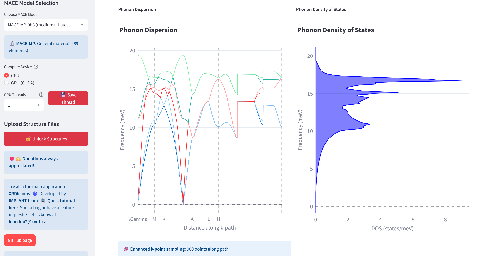

# uMLIP-Interactive: GUI for running simulations with universal machine learning interatomic potentials (uMLIP) - MACE, CHGNet, Nequix, SevenNet, Orb-v3, MatterSim, PET-MAD

Run basic molecular dynamics/static simulations:
- **single-point energy**
- **geometry optimization**
- **elastic properties**
- **phonons**
- **genetic algorithm for finding the energetically most favorible atomic site configurations of substitutes/vacancies**
- **Basic MD simulations (NVE, NVT, NPT)** with generated Python script
- *Currently working on: and **Nudge elastic band (NEB) calculations**.*  

In an **interactive interface for multiple input structure files** (POSCAR, CIF, LMP, XYZ with lattice) with a **machine learning MACE / CHGNet / Nequix / SevenNet / Orb-v3 / MatterSim / PET-MAD interatomic potentials**. It is also possible to generate Python code with the set settings and run the simulations directly in the console (currently works for energies, geometry optimization, elastic properties, and genetic algorithm). For the generated Python code, simply put it into an empty folder and run it. The structures that were uploaded to the app will be automatically created in the POSCAR format before the simulation start. 
The application also **supports selective dynamics in POSCAR** files, preserving the set constraints for specific atoms.

#### References
- 📖 If you like the app, **please cite** the following work (arXiv, preprint): [Lebeda, M., Drahokoupil, J., Mazáčová, V., & Vlčák, P. (2025). Revealing interstitial energetics in Ti-23Nb-0.7Ta-2Zr gum metal base alloy via universal machine learning interatomic potentials. arXiv preprint.](https://arxiv.org/abs/2512.05568). 
- 📖 Please also cite the **[Atomic Simulation Environment (ASE)](https://iopscience.iop.org/article/10.1088/1361-648X/aa680e/meta?casa_token=ylmp7uEZ-BYAAAAA:SRe2v_QrxXhw5O0ZrwNP5yyNQ8HbaG5vcbvBK98BQ6aZIs-qJ6C_1gjYBQ552Y68eJhnK0vPOheT8-R2gyGlaxCsnhGs)** and the employed uMLIP (you can see the corresponding publications for each model in the right corner of the app).  

#### Tutorials
- 🎥 **Video tutorial for the calculations within the interface at [YouTube](https://youtu.be/xh98fQqKXaI?si=m0Hysd9dvZis0any)**.   
- 🎥 **Video tutorial for using the genetic algorithm with MACE to obtain candidates for the lowest energy distributions of point defects in crystal structure [YouTube](https://youtu.be/SXUsAsatyRQ?si=3MKPwuyHk7AtLNeK)**.   
- 🎥 **Video tutorial for using the generated Python script for the calculations at [YouTube](https://youtu.be/w6hmvzC2J-8?si=9BYWJuUg7pohL1sw).** Make sure that before running the Python code, you activated the virtual Python environment with the installed necessary Python packages (Step 4 in the compilation manual below).

If you using the app, do not forgot from time to time to **update it with 'git pull' in the main folder** or download the newest **release**. I might be adding additional small features from time to time.   
If you have any request for improvements, additional features, or you spot a bug, please let me know: **lebedmi2@cvut.cz**  
Personal recommendation for the **maximum number of atoms** (for energies, geometry optimization) in a structure file: **below 1 000**. 

#### Currently supported uMLIP
- [MACE](https://github.com/ACEsuit/mace)  
- [CHGNet](https://github.com/CederGroupHub/chgnet)  
- [SevenNet](https://github.com/MDIL-SNU/SevenNet)  
- [Orb-v3](https://github.com/orbital-materials/orb-models)  
- [MatterSim](https://github.com/microsoft/mattersim)
- [Nequix](https://github.com/atomicarchitects/nequix)
- [PET-MAD](https://github.com/lab-cosmo/pet-mad)

---

### **Compile the app**  

If you are using Windows, please compile the app in WSL (if you do not have WSL, see how to install it first e.g. at: https://www.youtube.com/watch?v=zZf4YH4WiZo).

:warning: **Warning:**  The uMLIP-Interactive is currently tested with **Python 3.12**. Please download this version first. We noticed certain problems with Python 3.11 and Python 3.13 (Ubuntu 25.x natively has the 3.13 version). 

**Compile the app:** Open your terminal console and write the following commands (the bold text):  
(Optional) Install Git:  
      **sudo apt update**  
      **sudo apt install git**    

Currently, certain u-MLIP does not share compatible versions of certain packages (Torch, ...) with each other. Depending on which u-MLIP you want to use, please choose one option: 
#### To run simulations with **MACE, CHGNet, SevenNet, Orb-v3, and PET-MAD**:

  1) Download updates and prerequisites (if you are using WSL, include also 'python3.12-dev'):  
     **sudo apt update**  
     **sudo apt install build-essential python3-venv**  
     Download the app code from GitHub (or download it manually without Git on the following link by clicking on 'Code' and 'Download ZIP', then extract the ZIP. With Git, it is automatically   extracted):  
      **git clone https://github.com/bracerino/mace-md-gui.git**
  3) Navigate to the downloaded project folder:  
      **cd mace-md-gui/**  
  4) Create a Python virtual environment to prevent possible conflicts between packages:  
      **python3 -m venv mace_env**
  5) Activate the Python virtual environment (before activating, make sure you are inside the mace-md-gui folder):  
      **source mace_env/bin/activate**  
  6) Install all the necessary Python packages:  
   **pip install -r requirements.txt** (with CUDA for calculations on GPU), or (pip install -r requirements-no-cuda.txt (No GPU calculations))  
  7) Run the app (always before running it, make sure to activate its Python virtual environment (Step 4a):  
      **streamlit run app.py**
  8) To update the application, write in the main folder:  
      **git pull**

#### To run simulations with **MatterSim**:  
  1) Download updates and prerequisites:  
     **sudo apt update**  
     **sudo apt install -y python3-venv**  
     Download the app code from GitHub (or download it manually without Git on the following link by clicking on 'Code' and 'Download ZIP', then extract the ZIP. With Git, it is automatically   extracted):  
      **git clone https://github.com/bracerino/mace-md-gui.git**
  3) Navigate to the downloaded project folder:  
      **cd mace-md-gui/**  
  4) Create a Python virtual environment to prevent possible conflicts between packages:  
      **python3 -m venv mattersim_env**
  5) Activate the Python virtual environment (before activating, make sure you are inside the mace-md-gui folder):  
      **source mattersim_env/bin/activate**  
  6) Install all the necessary Python packages:  
   **pip install -r requirements-mattersim.txt** (with CUDA for calculations on GPU))  
  7) Run the app (always before running it, make sure to activate its Python virtual environment (Step 4a):  
      **streamlit run app.py**
  8) To update the application, write in the main folder:  
      **git pull**

 
### **Tested Python packages**  
- streamlit - 1.46.0  
- plotly - 6.1.2  
- pymatgen - 2025.6.14  
- ase - 3.25.0  
- phonopy - 2.40.0  
- py3Dmol - 2.5.0  
- psutil - 7.0.0  
- gputil - 1.4.0  
- torch - 2.7.1  
- torchvision - 0.22.1    
- torchaudio - 2.7.1
- mace-torch - 0.3.13    
- cuequivariance - 0.5.1  
- cuequivariance-torch - 0.5.1  
- cuequivariance-ops-torch-cu12 - 0.5.1  

### **Workflow**

---

---

---

---

---

---

