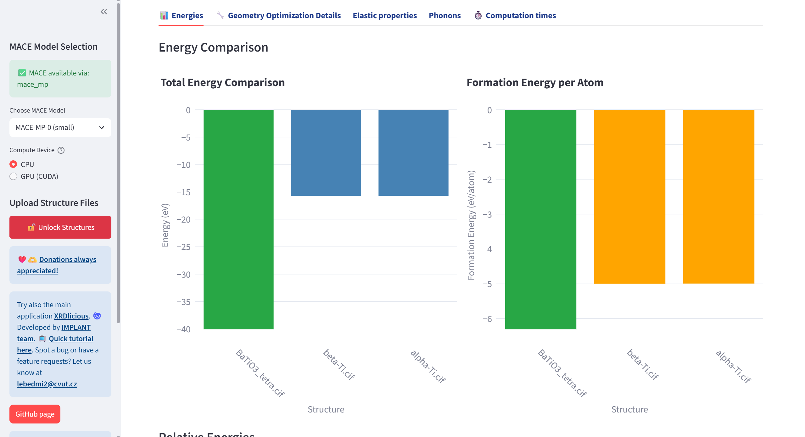
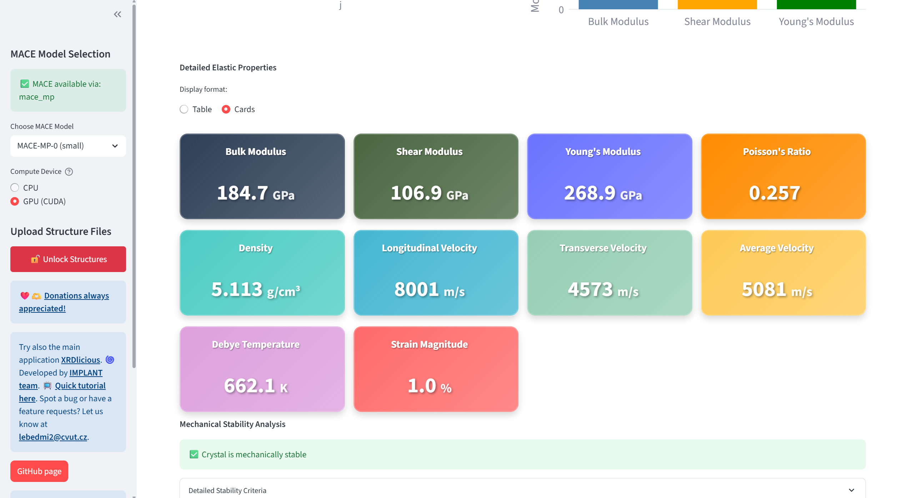
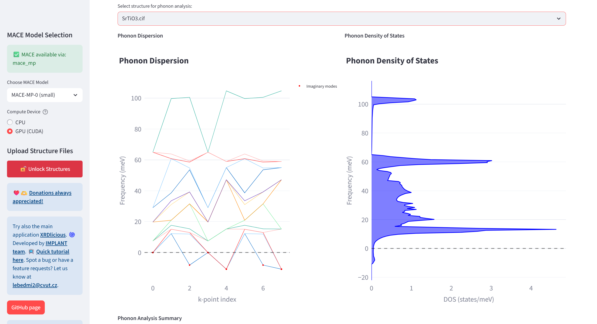
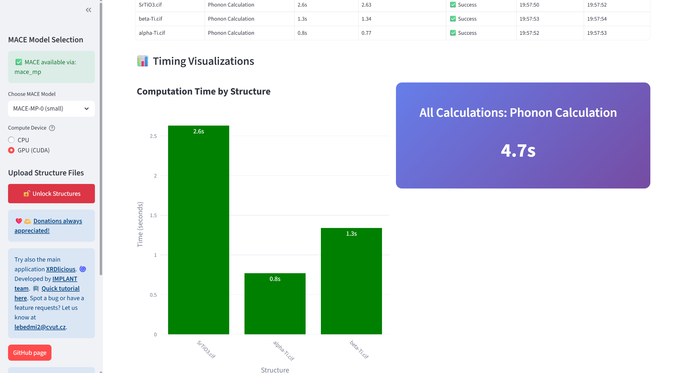

# mace-md-gui

Run basic molecular dynamics/static simulations (single-point energy, geometry optimization, elastic properties, phonons) in an interactive interface for multiple input structure files (POSCAR, CIF, LMP, XYZ with lattice) with a machine learning MACE MP interatomic potential.  
**Video tutorial at [YouTube](https://youtu.be/xh98fQqKXaI?si=m0Hysd9dvZis0any)**.  
If you using my app, do not forgot from time to time to **update it with 'git pull' in the main folder**, I might be adding additional small features.   
If you have any request for improvements, additional features, or you spot a bug, please let me know: **lebedmi2@cvut.cz**
Supported MACE MLIPs:  
**Anorganic**:  
- MP-0, MP-0b3, MPA, OMAT,  
- MATPES-PBE-0, MATPES-r2SCAN-0  

**Organic**:
- MACE-OFF23  
---

### **Compile the app**  

For calculations on **GPU, compile CUDA**:  
https://developer.nvidia.com/cuda-toolkit  
(do not forget to add it to the PATH, e.g.:  
export PATH=/usr/local/cuda-12.9/bin:$PATH  
export LD_LIBRARY_PATH=/usr/local/cuda-12.9/lib64:$LD_LIBRARY_PATH  )  

Open your terminal console and write the following commands (the bold text):  
(Optional) Install Git:  
      **sudo apt update**  
      **sudo apt install git**    
      
1) Download the app code from GitHub (or download it manually without Git on the following link by clicking on 'Code' and 'Download ZIP', then extract the ZIP. With Git, it is automatically extracted):  
      **git clone https://github.com/bracerino/mace-md-gui.git**

2) Navigate to the downloaded project folder:  
      **cd mace-md-gui/**

3) Create a Python virtual environment to prevent possible conflicts between packages:  
      **python3 -m venv mace_env**

4) Activate the Python virtual environment (before activating, make sure you are inside the mace-md-gui folder):  
      **source mace_env/bin/activate**
   
5) Install all the necessary Python packages:  
      **pip install -r requirements.txt**

6) Run the app (always before running it, make sure to activate its Python virtual environment (Step 4):  
      **streamlit run app.py**
7) To update the application, write in the main folder:  
      **git pull**
 
### **Tested Python packages**  
- streamlit - 1.46.0  
- plotly - 6.1.2  
- pymatgen - 2025.6.14  
- ase - 3.25.0  
- phonopy - 2.40.0  
- py3Dmol - 2.5.0  
- psutil - 7.0.0  
- gputil - 1.4.0  
- torch - 2.7.1  
- torchvision - 0.22.1    
- torchaudio - 2.7.1
- mace-torch - 0.3.13    
- cuequivariance - 0.5.1  
- cuequivariance-torch - 0.5.1  
- cuequivariance-ops-torch-cu12 - 0.5.1  

### **Workflow**

---

---

---

---

---

---

